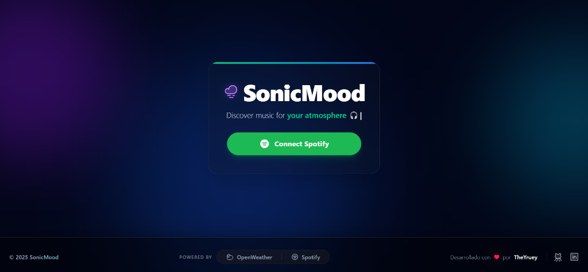

# 🎵 SonicMood

SonicMood es una **aplicación de descubrimiento musical basada en el clima**, construida con React, TypeScript y Vite. Conecta la "vibra" atmosférica de tu ubicación actual (o de cualquier ciudad del mundo) con la biblioteca de Spotify para generar la playlist perfecta para el momento.



## ✨ Características

- **Sol & Lluvia, Ritmo y Beat**: Obtiene automáticamente el clima local usando OpenWeatherMap y lo mapea a géneros musicales específicos (ej: *Lluvia + Noche = Jazz/Piano*, *Despejado + Día = Pop/Upbeat*).
- **Personalización Inteligente** 🧠: Utiliza tus **Top Artists** de Spotify como semillas para las recomendaciones, asegurando que la música sugerida se alinee con tus gustos personales.
- **Motor de Recomendación Robusto**: Sistema de fallbacks inteligente que combina `seed_artists`, `seed_genres` y una búsqueda de respaldo para garantizar que siempre recibas música, incluso si la API de recomendaciones falla.
- **Modo Teletransporte (Búsqueda)**: ¿No te gusta el clima de donde estás? Escribe el nombre de cualquier ciudad (ej: "Tokyo", "Paris") para experimentar la vibra de otro lugar con autocompletado inteligente.
- **Shuffle Vibe** 🔀: ¿No te convencen las canciones? Baraja las recomendaciones manteniendo la misma atmósfera climática.
- **Integración Fluida con Spotify**:
  - Flujo de autenticación **PKCE** seguro (sin exponer secretos del cliente).
  - Previsualización de audio (30s) directamente desde las tarjetas de canciones.
  - **Guardar en Biblioteca**: Crea una nueva playlist directamente en tu cuenta de Spotify con un solo clic.
- **Experiencia Visual Inmersiva**:
  - Fondo animado con orbes de colores y efecto aurora.
  - Textos dinámicos con efecto de máquina de escribir.
  - Interfaz "Glassmorphism" pulida y moderna.
- **Estado Persistente**: Tu sesión, datos del clima y canciones generadas sobreviven a recargas de página.

## 🛠️ Stack Tecnológico

- **Frontend**: React 18, TypeScript, Vite
- **Estilos**: Tailwind CSS (compatible v4), Headless UI
- **Gestión de Estado**: Zustand (con Middleware de Persistencia)
- **Componentes UI**:
  - Tarjetas con efecto de vidrio (GlassCard)
  - Typewriter Effects (Textos dinámicos)
  - Animated Backgrounds (Blobs CSS animados)
- **APIs**: 
  - [Spotify Web API](https://developer.spotify.com/) (Auth, User Top, Recommendations, Playlists)
  - [OpenWeatherMap API](https://openweathermap.org/) (Datos del clima y Geocoding)

## 🚀 Comenzando

### Prerrequisitos

Necesitas claves de API (API Keys) para:
1.  **[Spotify Developer Dashboard](https://developer.spotify.com/)**: Crea una app y configura la "Redirect URI" a `http://localhost:5173/`.
2.  **[OpenWeatherMap](https://openweathermap.org/)**: Regístrate para obtener una clave gratuita.

### Instalación

1.  Clona el repositorio:
    ```bash
    git clone https://github.com/TheYruey/SonicMood.git
    cd SonicMood
    ```

2.  Instala las dependencias:
    ```bash
    npm install
    ```

3.  Configura las Variables de Entorno:
    Crea un archivo `.env` en el directorio raíz (basado en `.env.example` si existe) y añade:

    ```env
    VITE_SPOTIFY_CLIENT_ID=tu_cliente_id_de_spotify_aqui
    VITE_WEATHER_API_KEY=tu_api_key_de_openweathermap_aqui
    VITE_SPOTIFY_REDIRECT_URI=http://localhost:5173/
    ```

    > **Nota de Seguridad:** Nunca subas tu archivo `.env` al control de versiones. Ya está añadido en `.gitignore` por defecto.

4.  Ejecuta el servidor de desarrollo:
    ```bash
    npm run dev
    ```

## 📂 Estructura del Proyecto

- `src/services/api.ts`: Maneja todas las llamadas a API. Incluye lógica avanzada de recomendación y obtención de top artists.
- `src/store/useStore.ts`: Gestión de estado global con Zustand.
- `src/utils/auth.ts`: Auth PKCE (Scope actualizado: `user-top-read`).
- `src/utils/moodMap.ts`: Lógica de mapeo clima -> audio features / géneros.
- `src/components/ui/TrackCard.tsx`: Tarjeta de canción con reproducción de preview.
- `src/components/ui/AnimatedBackground.tsx`: Fondo ambiental dinámico.
- `src/components/ui/TypewriterText.tsx`: Componentes de texto animado.

## 🤝 Contribuciones

¡Las contribuciones son bienvenidas! Siéntete libre de enviar un Pull Request.

## 📄 Licencia

Este proyecto es open source y está disponible bajo la [Licencia MIT](LICENSE).
